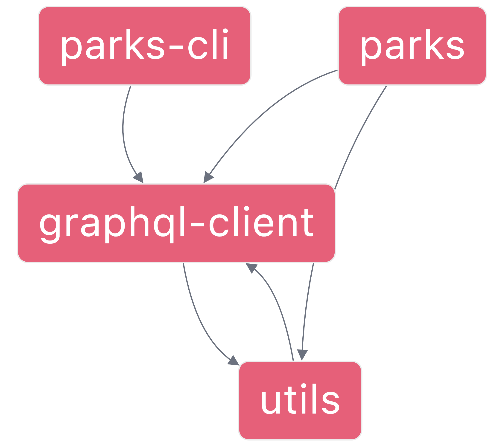

# Parks

Refactoring kata using the [Mikado Method](https://mikadomethod.info):

1. Set a goal
2. Experiment
3. Visualize
4. Undo

**Goal**: Remove `utils` dependency on `graphql-client`

*This project was generated using [Nx](https://nx.dev).*

